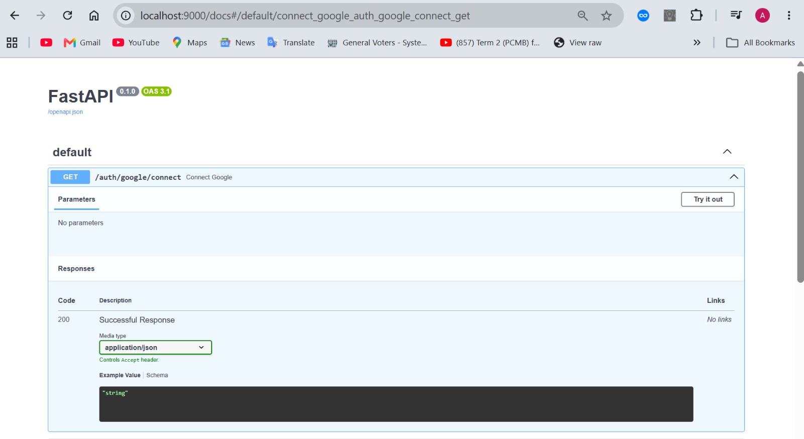
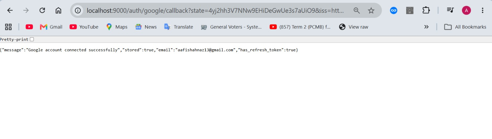
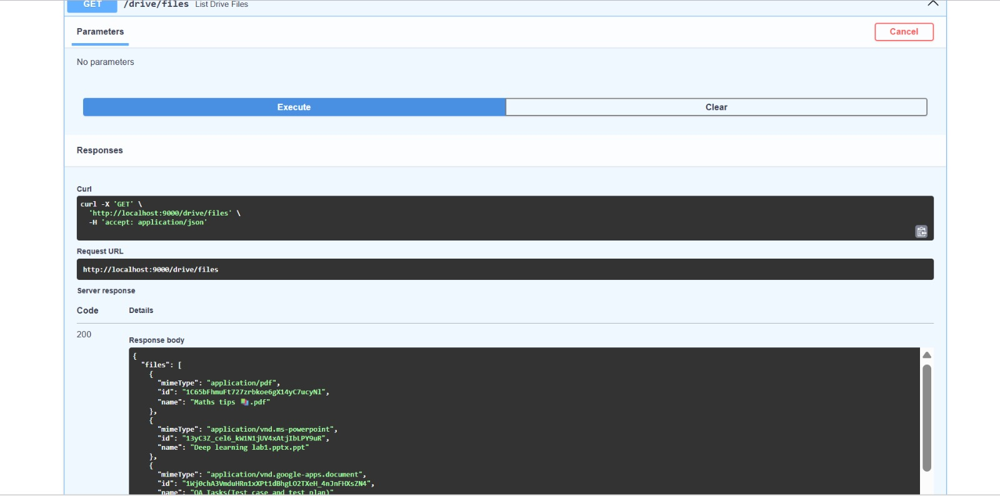
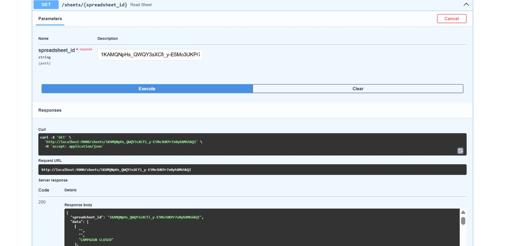
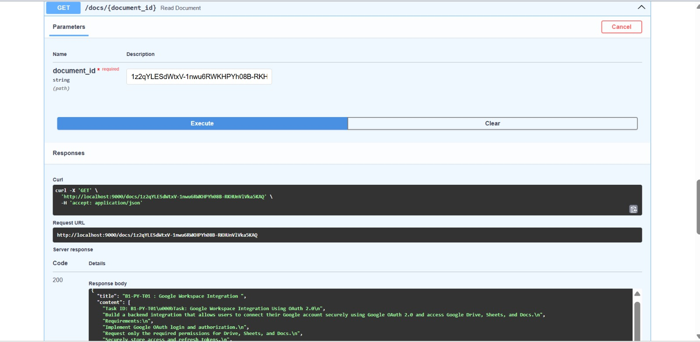
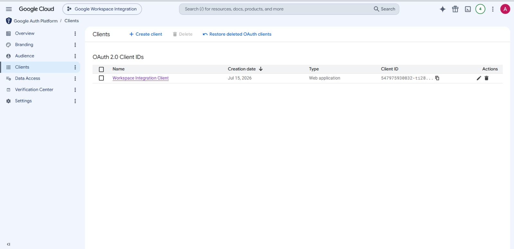

# Google Workspace Integration Service
> Backend service integrating Google Drive, Google Sheets, and Google Docs using FastAPI, OAuth 2.0, and SQLAlchemy.

A FastAPI-based backend service that integrates with Google Workspace using OAuth 2.0 authentication.

The application allows users to securely connect their Google account and access Google Drive, Google Sheets, and Google Docs resources through REST APIs.

## Project Highlights

- Implemented Google OAuth 2.0 Authorization Code Flow
- Integrated Google Drive API for file retrieval
- Integrated Google Sheets API for spreadsheet access
- Integrated Google Docs API for document content extraction
- Secure token storage using SQLAlchemy and SQLite
- Interactive API documentation with Swagger UI

---

## Features

- Google OAuth 2.0 Authentication
- Secure Credential Storage
- Google Drive Integration
- Google Sheets Integration
- Google Docs Integration
- Disconnect Google Account
- Interactive Swagger API Documentation

---

## Tech Stack

- Python
- FastAPI
- SQLAlchemy
- SQLite
- Google OAuth 2.0
- Google Drive API
- Google Sheets API
- Google Docs API

---

## Project Architecture

```text
User
 │
 ▼
Google OAuth 2.0
 │
 ▼
Authorization Code
 │
 ▼
Access Token + Refresh Token
 │
 ▼
SQLite Database
 │
 ├── Drive API
 ├── Sheets API
 └── Docs API
```

---

## Project Structure

```text
google_workspace_integration
│
├── app
│   ├── auth.py
│   ├── drive.py
│   ├── sheets.py
│   ├── docs.py
│   ├── services.py
│   ├── models.py
│   ├── database.py
│   ├── config.py
│   └── main.py
│
├── requirements.txt
├── README.md
└── .gitignore
```

---

## Installation

Clone the repository

```bash
git clone https://github.com/Afrin26S/google-workspace-integration.git
cd google-workspace-integration
```

Install dependencies

```bash
pip install -r requirements.txt
```

Create `.env`

```env
CLIENT_ID=your_google_client_id
CLIENT_SECRET=your_google_client_secret
REDIRECT_URI=http://localhost:9000/auth/google/callback
```

Run the application

```bash
uvicorn app.main:app --reload --port 9000
```

---

## API Endpoints

### Authentication

```http
GET /auth/google/connect
GET /auth/google/callback
DELETE /auth/google/disconnect
```

### Google Drive

```http
GET /drive/files
```

Returns all accessible Drive files.

---

### Google Sheets

```http
GET /sheets/{spreadsheet_id}
```

Reads spreadsheet data from a Google Sheet.

---

### Google Docs

```http
GET /docs/{document_id}
```

Reads content from a Google Document.


---

# Screenshots

## FastAPI Swagger UI



---

## Google OAuth Success



---

## Google Drive API Response



---

## Google Sheets API Response



---

## Google Docs API Response



---

## Google Cloud OAuth Configuration


